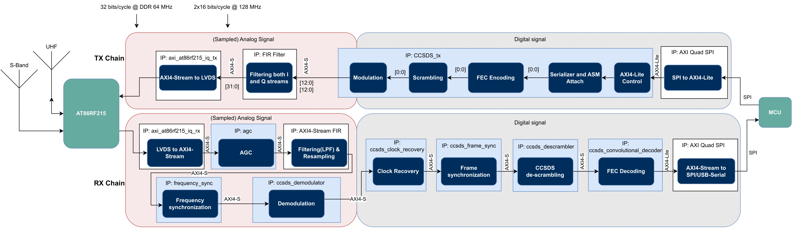

# SatNOGS COMMS FPGA Implementation

This project is about the FPGA implementation of the dual-band satellite transceiver, the SatNOGS COMMS\[1\]. The goal of the project is to implement all signal processing on the FPGA complying with the CCSDS\[2\] standards for telemetry \(TM\) and telecommand (TC). Specifically, the recommended standards CCSDS 401.0-B-32, CCSDS 231.0-B-4, CCSDS 232.0-B-4, CCSDS 131.0-B-4, CCSDS 231.0-B-4 are adhered to. Next to this, software for the microcontroller is developed to control the FPGA to have a reliable protocol for receiving telecommands and sending telemetry data. The flowchart of the implemented system is as follows:

## Background

The ARIS SAGE\[3\] CubeSat team is developing a 3U CubeSat to demonstrate a microgravity platform in orbit. For this, a reliable communication link is required to send commands to the spacecraft and receive the telemetry data from the biological payload. The hardware for the dual-band transceiver is based on an open-source project from LibreSpace Foundation and is already developed\[4\]. What is left to develop is the SystemVerilog code for the Xilinx FPGA to implement the signal processing of the IQ data coming from the integrated Atmel AT86RF215 IC\[5\].

## Project structure

- `docs/`: Contains documentation related to the project. For example, flowcharts visualizing the FPGA processing flow.
- `sim/`: Houses simulation scripts, primarily MATLAB for verifying the functionality and comparing different modulations and FECs.

### FPGA Part:
  
- `ip_repo/`: Houses custom IPs used in the FPGA project.
  - `CCSDS_tx_ip_1.0/`: An IP for transmitting CCSDS data packets.
    - `hdl/`: Contains the RTL (Register Transfer Level) design of the IP and its modules.
      - `modules/`: Consists of smaller individual modules.
      - `tb/`: Testbenches for the RTL design.
        - `modules_tb/`: Unit testbenches for individual modules.
        - `top_tb/`: Integration testbenches for the complete IP.
    - `example_designs/`: Provides example designs utilizing the IP.
  
- `vivado_proj/`: Contains the main Vivado project, constraints, and any necessary scripts.

### STM32 Part:

- `software/`: Contains the software development related to STM32.
  - `stm32_proj/`: The STM32 project directory.
    - `SPI_UART_Test/`: Directory specifically for testing transmission with PYNQ-Z2 and Nucleo development boards.
  
 

## Getting started

FPGA Component:
---------------

### Prerequisites:

-   Software: Xilinx Vivado 2020.2
-   Hardware: PYNQ-Z2 Development board or SatNOGS COMMS board with Digilent HS2 programmer(or equivalent)

### Setup:

1.  Clone the Repository:

    `git clone https://github.com/lionnus/SatNOGS-COMMS-FPGA
    cd https://github.com/lionnus/SatNOGS-COMMS-FPGA`

2.  Create the FPGA Project: Navigate to the `vivado_proj/scripts` directory and run the Tcl script to set up the Vivado project.

    `cd vivado_proj/scripts
    vivado -mode batch -source init_project.tcl`

3.  Open the Vivado Project:

    `vivado FPGA-STM32-SPI.xpr`

4.  Build the Project:

    -   In the Vivado IDE, click on Generate Bitstream. This will synthesize, implement, and finally generate the FPGA bitstream.
5.  Testing:

    -   Load the generated bitstream onto the Pynq-Z2 development board or the ALINX XC7Z020 FPGA module on the SatNOGS(e.g. using the Digilent HS2).
    -   Set up the STM32 (see below).
6.  Documentation: For more details on the FPGA flow and architecture, refer to the docs of the repository and the SatNOGS COMMS repositories.

* * * * *

STM32 Component:
----------------

### Prerequisites:

-   Software: STM32CubeIDE for development, or STM32CubeProgrammer for SatNOGS
-   Hardware: STM32H723 Development board or SatNOGS COMMS board

### Setup:
#### For the development board:
1.  Import the STM32 Project:

    -   Open STM32CubeIDE.
    -   Navigate to File > Import > Existing Projects into Workspace.
    -   Browse to the `software/stm32_proj` directory and select the project folder.
2.  Compile and flash the Code:

    -   Right-click on the project in the Project Explorer.
    -   Select Run/Debug Project.
3.  Open a UART connection, e.g. on Ubuntu:
    `screen /dev/ttyACM0 115200`
4. Follow printed instructions in the terminal

#### Instructions for the SatNOGS COMMS board will follow later.

## References

\[1\]: https://libre.space/projects/satnogs-comms/

\[2\]: https://public.ccsds.org/publications/bluebooks.aspx

\[3\]: https://aris-space.ch/sage-cubesat/

\[4\]: https://gitlab.com/librespacefoundation/satnogs-comm

\[5\]: https://www.microchip.com/en-us/product/AT86RF215

## License

This project is licensed under the GNU GPL version 3 license - see the `LICENSE` file for details.
